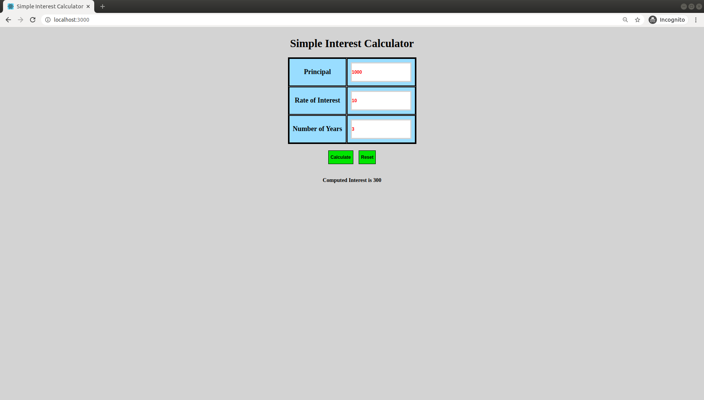

# Simple Interest Calculator Client

A Single page React Application to computing simple interest using the api.

## Getting started

1. Deploy the backend api server (https://github.com/neethu-ms/SpringBoot/tree/master/SimpleInterestCalculator)

2. Do the setup for front end \
   a. Fork the repo \
   b. npm install \
   c. npm start
   d. Access the application in http://localhost:3000

## Screenshots

   
